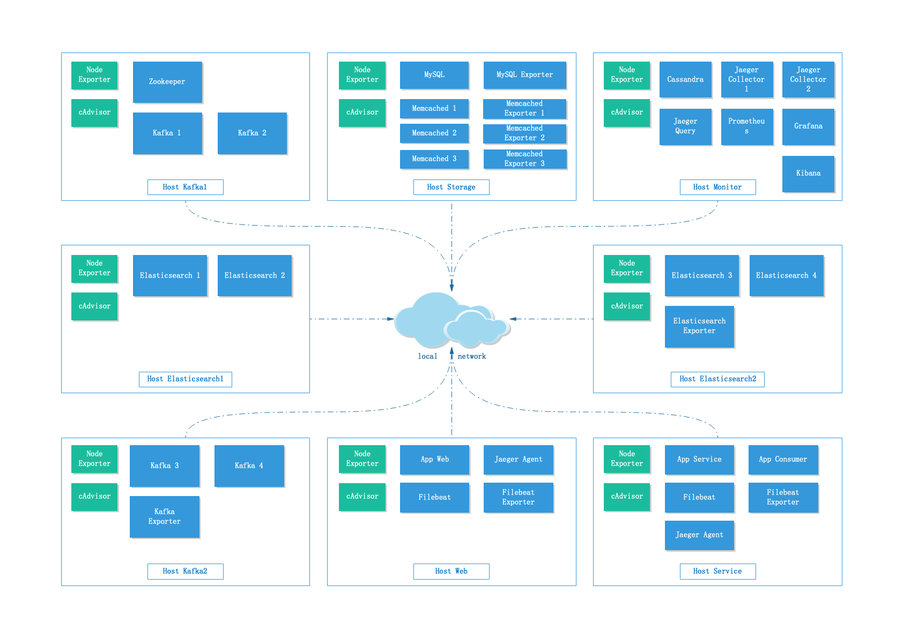
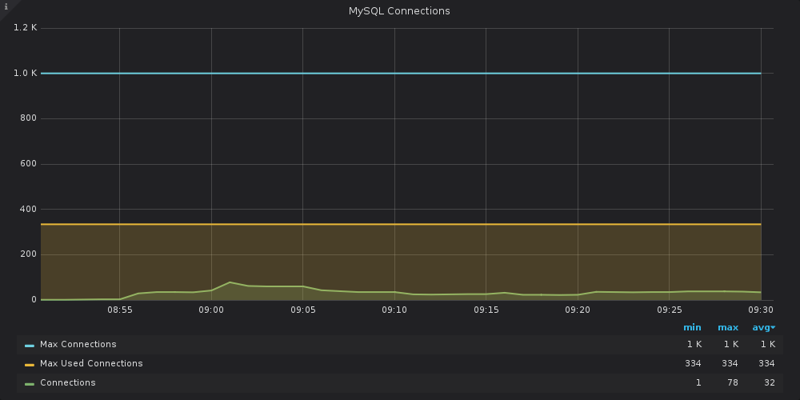
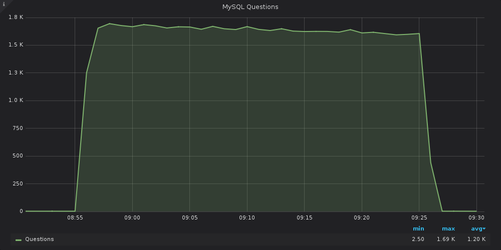
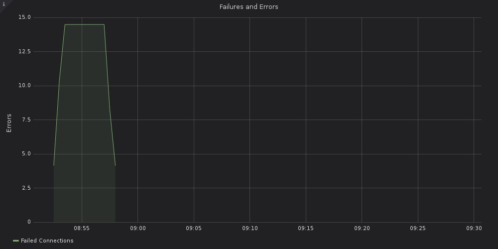

# REPORT 1562981458710

[toc]

## 1. 测试硬件
```
$ wget -qO- bench.sh | bash

----------------------------------------------------------------------
CPU model            : AMD EPYC 7601 32-Core Processor
Number of cores      : 6
CPU frequency        : 2199.996 MHz
Total size of Disk   : 315.0 GB (2.2 GB Used)
Total amount of Mem  : 16040 MB (120 MB Used)
Total amount of Swap : 511 MB (0 MB Used)
System uptime        : 0 days, 0 hour 2 min
Load average         : 0.29, 0.22, 0.09
OS                   : Ubuntu 18.04.2 LTS
Arch                 : x86\_64 (64 Bit)
Kernel               : 4.15.0-50-generic
----------------------------------------------------------------------
I/O speed(1st run)   : 892 MB/s
I/O speed(2nd run)   : 1.1 GB/s
I/O speed(3rd run)   : 1.0 GB/s
Average I/O speed    : 1014.1 MB/s
----------------------------------------------------------------------
Node Name                       IPv4 address            Download Speed
CacheFly                        205.234.175.175         144MB/s
Linode, Tokyo, JP               106.187.96.148          20.7MB/s
Linode, Singapore, SG           139.162.23.4            6.48MB/s
Linode, London, UK              176.58.107.39           9.71MB/s
Linode, Frankfurt, DE           139.162.130.8           15.4MB/s
Linode, Fremont, CA             50.116.14.9             205MB/s
Softlayer, Dallas, TX           173.192.68.18           44.9MB/s
Softlayer, Seattle, WA          67.228.112.250          44.8MB/s
Softlayer, Frankfurt, DE        159.122.69.4            4.92MB/s
Softlayer, Singapore, SG        119.81.28.170           8.21MB/s
Softlayer, HongKong, CN         119.81.130.170          10.4MB/s
----------------------------------------------------------------------
Node Name                       IPv6 address            Download Speed
Linode, Atlanta, GA             2600:3c02::4b           39.3MB/s
Linode, Dallas, TX              2600:3c00::4b           28.9MB/s
Linode, Newark, NJ              2600:3c03::4b           18.3MB/s
Linode, Singapore, SG           2400:8901::4b           5.36MB/s
Linode, Tokyo, JP               2400:8900::4b           20.5MB/s
Softlayer, San Jose, CA         2607:f0d0:2601:2a::4    95.4MB/s
...
----------------------------------------------------------------------
```

```
$ (curl -s wget.racing/nench.sh | bash) 2>&1 | tee nench.log

-------------------------------------------------
nench.sh v2019.06.29 -- https://git.io/nench.sh
benchmark timestamp:    2019-07-12 05:48:17 UTC
-------------------------------------------------

Processor:    AMD EPYC 7601 32-Core Processor
CPU cores:    6
Frequency:    2199.996 MHz
RAM:          15G
Swap:         511M
Kernel:       Linux 4.15.0-50-generic x86\_64

Disks:
sda  319.5G  HDD
sdb    512M  HDD

CPU: SHA256-hashing 500 MB
2.962 seconds
CPU: bzip2-compressing 500 MB
6.310 seconds
CPU: AES-encrypting 500 MB
1.362 seconds

ioping: seek rate
min/avg/max/mdev = 62.2 us / 112.5 us / 2.94 ms / 75.5 us
ioping: sequential read speed
generated 16.5 k requests in 5.00 s, 4.03 GiB, 3.30 k iops, 824.3 MiB/s

dd: sequential write speed
1st run:    855.45 MiB/s
2nd run:    1049.04 MiB/s
3rd run:    1049.04 MiB/s
average:    984.51 MiB/s

IPv4 speedtests
your IPv4:    173.255.252.xxxx

Cachefly CDN:         175.13 MiB/s
Leaseweb (NL):        13.85 MiB/s
Softlayer DAL (US):   38.74 MiB/s
Online.net (FR):      11.06 MiB/s
OVH BHS (CA):         16.75 MiB/s

IPv6 speedtests
your IPv6:    2600:3c01::xxxx

Leaseweb (NL):        7.77 MiB/s
Softlayer DAL (US):   0.00 MiB/s
Online.net (FR):      8.44 MiB/s
OVH BHS (CA):         17.60 MiB/s
-------------------------------------------------
```

## 2. 服务器架构 & 拓扑
### 2.1 架构图


### 2.2 部署拓扑图


## 3. 测试变量

* 客户端连接数：10000
* 客户端请求速率：1000/s
* 数据库表量级：5000000
* 数据库连接：1000
* Kafka Topic的分片数量：20
* 各服务的JVM设置：
    * Kafka：KAFKA\_HEAP\_OPTS="-Xms6G -Xmx6G"
    * Elasticsearch：ES\_JAVA\_OPTS="-Xms6G -Xmx6G"
    * Cassandra：
        * JAVA\_OPTS="-Dfile.encoding=UTF-8 -Xms9G -Xmx9G"
        * MAX\_HEAP\_SIZE=8G
        * HEAP\_NEWSIZE=600M
* 消费者计算因子：1

## 4. 压测客户端报表
```
Requests      [total, rate]            1800000, 1000.00
Duration      [total, attack, wait]    30m0.924265075s, 29m59.998681331s, 925.583744ms
Latencies     [mean, 50, 95, 99, max]  35.297112ms, 4.448245ms, 61.083044ms, 1.008728298s, 1.148852087s
Bytes In      [total, mean]            124943725, 69.41
Bytes Out     [total, mean]            0, 0.00
Success       [ratio]                  100.00%
Status Codes  [code:count]             200:1799999  500:1
Error Set:
500 Internal Server Error
```

## 5. 结论


## 6. Elasticsearch数据
### 6.1 All Web requests


### 6.2 All Consumer requests


81 / 1552 = 5.21%；√✗

### 6.3 GetWork


704 / 1552 = 45.36%；√✗

### 6.4 UpdateViewed


364 / 1552 = 23.45%；√✗

### 6.5 GetAchievement


403 / 1552 = 25.96%；√✗

### 6.6 PlanWork


与Consumer计数匹配；√✗

## 7. Jaeger数据
### 7.1 GetWork


### 7.2 UpdateViewed


### 7.3 GetAchievement


### 7.4 PlanWork


### 7.5 Consumer


## 8. Go App Profiling
### 8.1 Web
#### Memory HEAP


#### CPU


### 8.2 Service
#### Memory HEAP


#### CPU


### 8.3 Consumer
#### Memory HEAP


#### CPU


## 9. 监控指标
### Host: client

* name: client
* type: client

#### Service: node\_client

* name: node\_client
* type: node\_exporter

**系统运行时间**


**CPU 核数**


**内存总量**


**CPU使用率（5m）**


**CPU iowait（5m）**


**内存使用率**


**当前打开的文件描述符**


**根分区使用率**


**系统平均负载**


**磁盘总空间**


**各分区可用空间**


**CPU使用率、磁盘每秒的I/O操作耗费时间（%）**


**内存信息**


**磁盘读写速率（IOPS）**


**磁盘读写容量大小**


**磁盘IO读写时间**


**网络流量**


**TCP 连接情况**


#### Service: cadvisor\_client

* name: cadvisor\_client
* type: cadvisor

**Received Network Traffic per Container**


**Sent Network Traffic per Container**


**CPU Usage per Container**


**Memory Usage per Container**


**Memory Swap per Container**


### Host: storage

* name: storage
* type: storage

#### Service: node\_storage

* name: node\_storage
* type: node\_exporter

**系统运行时间**


**CPU 核数**


**内存总量**


**CPU使用率（5m）**


**CPU iowait（5m）**


**内存使用率**


**当前打开的文件描述符**


**根分区使用率**


**系统平均负载**


**磁盘总空间**


**各分区可用空间**


**CPU使用率、磁盘每秒的I/O操作耗费时间（%）**


**内存信息**


**磁盘读写速率（IOPS）**


**磁盘读写容量大小**


**磁盘IO读写时间**


**网络流量**


**TCP 连接情况**


#### Service: cadvisor\_storage

* name: cadvisor\_storage
* type: cadvisor

**Received Network Traffic per Container**


**Sent Network Traffic per Container**


**CPU Usage per Container**


**Memory Usage per Container**


**Memory Swap per Container**


#### Service: mysqld

* name: mysqld
* type: mysqld

**MySQL Connections**



**MySQL Aborted Connections**


**MySQL Client Thread Activity**


**MySQL Thread Cache**


**MySQL Questions**



**MySQL Slow Queries**


**MySQL Table Locks**


**MySQL Network Traffic**


**MySQL Network Usage Hourly**


**MySQL Internal Memory Overview**


**Top Command Counters**


**Top Command Counters Hourly**


**MySQL Query Cache Memory**


**MySQL Query Cache Activity**


**MySQL File Openings**


**MySQL Open Files**


#### Service: memcached\_1

* name: memcached\_1
* type: memcached

**% Hit ratio**


**Connections**


**Get / Set ratio**


**Commands**


**evicts / reclaims**


**Read / written bytes**


**Total memory usage**


**Items in cache**


#### Service: memcached\_2

* name: memcached\_2
* type: memcached

**% Hit ratio**


**Connections**


**Get / Set ratio**


**Commands**


**evicts / reclaims**


**Read / written bytes**


**Total memory usage**


**Items in cache**


#### Service: memcached\_3

* name: memcached\_3
* type: memcached

**% Hit ratio**


**Connections**


**Get / Set ratio**


**Commands**


**evicts / reclaims**


**Read / written bytes**


**Total memory usage**


**Items in cache**


### Host: kafka1

* name: kafka1
* type: kafka

#### Service: node\_kafka\_1

* name: node\_kafka\_1
* type: node\_exporter

**系统运行时间**


**CPU 核数**


**内存总量**


**CPU使用率（5m）**


**CPU iowait（5m）**


**内存使用率**


**当前打开的文件描述符**


**根分区使用率**


**系统平均负载**


**磁盘总空间**


**各分区可用空间**


**CPU使用率、磁盘每秒的I/O操作耗费时间（%）**


**内存信息**


**磁盘读写速率（IOPS）**


**磁盘读写容量大小**


**磁盘IO读写时间**


**网络流量**


**TCP 连接情况**


#### Service: cadvisor\_kafka\_1

* name: cadvisor\_kafka\_1
* type: cadvisor

**Received Network Traffic per Container**


**Sent Network Traffic per Container**


**CPU Usage per Container**


**Memory Usage per Container**


**Memory Swap per Container**


#### Service: kafka\_1

* name: kafka\_1
* type: kafka

**Open file descriptors**


**CPU load**


**Memory area [heap]**


**Memory area [nonheap]**


**GC count increase**


**GC time**


**Threads used**


**Physical memory**


#### Service: kafka\_2

* name: kafka\_2
* type: kafka

**Open file descriptors**


**CPU load**


**Memory area [heap]**


**Memory area [nonheap]**


**GC count increase**


**GC time**


**Threads used**


**Physical memory**


### Host: kafka2

* name: kafka2
* type: kafka

#### Service: node\_kafka\_2

* name: node\_kafka\_2
* type: node\_exporter

**系统运行时间**


**CPU 核数**


**内存总量**


**CPU使用率（5m）**


**CPU iowait（5m）**


**内存使用率**


**当前打开的文件描述符**


**根分区使用率**


**系统平均负载**


**磁盘总空间**


**各分区可用空间**


**CPU使用率、磁盘每秒的I/O操作耗费时间（%）**


**内存信息**


**磁盘读写速率（IOPS）**


**磁盘读写容量大小**


**磁盘IO读写时间**


**网络流量**


**TCP 连接情况**


#### Service: cadvisor\_kafka\_2

* name: cadvisor\_kafka\_2
* type: cadvisor

**Received Network Traffic per Container**


**Sent Network Traffic per Container**


**CPU Usage per Container**


**Memory Usage per Container**


**Memory Swap per Container**


#### Service: kafka\_3

* name: kafka\_3
* type: kafka

**Open file descriptors**


**CPU load**


**Memory area [heap]**


**Memory area [nonheap]**


**GC count increase**


**GC time**


**Threads used**


**Physical memory**


#### Service: kafka\_4

* name: kafka\_4
* type: kafka

**Open file descriptors**


**CPU load**


**Memory area [heap]**


**Memory area [nonheap]**


**GC count increase**


**GC time**


**Threads used**


**Physical memory**


#### Service: kafka\_exporter

* name: kafka\_exporter
* type: kafka\_exporter

**Message in per second**


**Lag by Consumer Group**


**Message in per minute**


**Message consume per minute**


### Host: es1

* name: es1
* type: elasticsearch

#### Service: node\_es\_1

* name: node\_es\_1
* type: node\_exporter

**系统运行时间**


**CPU 核数**


**内存总量**


**CPU使用率（5m）**


**CPU iowait（5m）**


**内存使用率**


**当前打开的文件描述符**


**根分区使用率**


**系统平均负载**


**磁盘总空间**


**各分区可用空间**


**CPU使用率、磁盘每秒的I/O操作耗费时间（%）**


**内存信息**


**磁盘读写速率（IOPS）**


**磁盘读写容量大小**


**磁盘IO读写时间**


**网络流量**


**TCP 连接情况**


#### Service: cadvisor\_es\_1

* name: cadvisor\_es\_1
* type: cadvisor

**Received Network Traffic per Container**


**Sent Network Traffic per Container**


**CPU Usage per Container**


**Memory Usage per Container**


**Memory Swap per Container**


#### Service: es\_1

* name: es\_1
* type: elasticsearch

**Pending tasks**


**Load average**


**CPU usage**


**JVM memory usage**


**GC count**


**GC time**


**Total translog operations**


**Total translog size in bytes**


**Tripped for breakers**


**Estimated size in bytes of breaker**


**Disk usage**


**Network usage**


**Documents count on node**


**Documents indexed rate**


**Documents merged rate**


**Documents merged bytes**


**Query time**


**Indexing time**


**Merging time**


**Total Operations rate**


**Total Operations time**


#### Service: es\_2

* name: es\_2
* type: elasticsearch

**Pending tasks**


**Load average**


**CPU usage**


**JVM memory usage**


**GC count**


**GC time**


**Total translog operations**


**Total translog size in bytes**


**Tripped for breakers**


**Estimated size in bytes of breaker**


**Disk usage**


**Network usage**


**Documents count on node**


**Documents indexed rate**


**Documents merged rate**


**Documents merged bytes**


**Query time**


**Indexing time**


**Merging time**


**Total Operations rate**


**Total Operations time**


### Host: es2

* name: es2
* type: elasticsearch

#### Service: node\_es\_2

* name: node\_es\_2
* type: node\_exporter

**系统运行时间**


**CPU 核数**


**内存总量**


**CPU使用率（5m）**


**CPU iowait（5m）**


**内存使用率**


**当前打开的文件描述符**


**根分区使用率**


**系统平均负载**


**磁盘总空间**


**各分区可用空间**


**CPU使用率、磁盘每秒的I/O操作耗费时间（%）**


**内存信息**


**磁盘读写速率（IOPS）**


**磁盘读写容量大小**


**磁盘IO读写时间**


**网络流量**


**TCP 连接情况**


#### Service: cadvisor\_es\_2

* name: cadvisor\_es\_2
* type: cadvisor

**Received Network Traffic per Container**


**Sent Network Traffic per Container**


**CPU Usage per Container**


**Memory Usage per Container**


**Memory Swap per Container**


#### Service: es\_3

* name: es\_3
* type: elasticsearch

**Pending tasks**


**Load average**


**CPU usage**


**JVM memory usage**


**GC count**


**GC time**


**Total translog operations**


**Total translog size in bytes**


**Tripped for breakers**


**Estimated size in bytes of breaker**


**Disk usage**


**Network usage**


**Documents count on node**


**Documents indexed rate**


**Documents merged rate**


**Documents merged bytes**


**Query time**


**Indexing time**


**Merging time**


**Total Operations rate**


**Total Operations time**


#### Service: es\_4

* name: es\_4
* type: elasticsearch

**Pending tasks**


**Load average**


**CPU usage**


**JVM memory usage**


**GC count**


**GC time**


**Total translog operations**


**Total translog size in bytes**


**Tripped for breakers**


**Estimated size in bytes of breaker**


**Disk usage**


**Network usage**


**Documents count on node**


**Documents indexed rate**


**Documents merged rate**


**Documents merged bytes**


**Query time**


**Indexing time**


**Merging time**


**Total Operations rate**


**Total Operations time**


### Host: monitor

* name: monitor
* type: monitor

#### Service: node\_monitor

* name: node\_monitor
* type: node\_exporter

**系统运行时间**


**CPU 核数**


**内存总量**


**CPU使用率（5m）**


**CPU iowait（5m）**


**内存使用率**


**当前打开的文件描述符**


**根分区使用率**


**系统平均负载**


**磁盘总空间**


**各分区可用空间**


**CPU使用率、磁盘每秒的I/O操作耗费时间（%）**


**内存信息**


**磁盘读写速率（IOPS）**


**磁盘读写容量大小**


**磁盘IO读写时间**


**网络流量**


**TCP 连接情况**


#### Service: cadvisor\_monitor

* name: cadvisor\_monitor
* type: cadvisor

**Received Network Traffic per Container**


**Sent Network Traffic per Container**


**CPU Usage per Container**


**Memory Usage per Container**


**Memory Swap per Container**


#### Service: jcollector\_1

* name: jcollector\_1
* type: jaeger\_collector

**Traces received**


**Traces rejected**


**Spans received**


**Spans dropped**


**Spans rejected**


**Queue length**


**Span queue latency**


**Save latency**


**Cassandra attempts**


**Cassandra errors**


#### Service: jcollector\_2

* name: jcollector\_2
* type: jaeger\_collector

**Traces received**


**Traces rejected**


**Spans received**


**Spans dropped**


**Spans rejected**


**Queue length**


**Span queue latency**


**Save latency**


**Cassandra attempts**


**Cassandra errors**


#### Service: prometheus

* name: prometheus
* type: prometheus

**Series Count**


**Failures and Errors**



**Appended Samples per Second**


**Scrape Duration**


**Prometheus Engine Query Duration Seconds**


### Host: service

* name: service
* type: service

#### Service: node\_service

* name: node\_service
* type: node\_exporter

**系统运行时间**


**CPU 核数**


**内存总量**


**CPU使用率（5m）**


**CPU iowait（5m）**


**内存使用率**


**当前打开的文件描述符**


**根分区使用率**


**系统平均负载**


**磁盘总空间**


**各分区可用空间**


**CPU使用率、磁盘每秒的I/O操作耗费时间（%）**


**内存信息**


**磁盘读写速率（IOPS）**


**磁盘读写容量大小**


**磁盘IO读写时间**


**网络流量**


**TCP 连接情况**


#### Service: cadvisor\_service

* name: cadvisor\_service
* type: cadvisor

**Received Network Traffic per Container**


**Sent Network Traffic per Container**


**CPU Usage per Container**


**Memory Usage per Container**


**Memory Swap per Container**


#### Service: jagent\_service

* name: jagent\_service
* type: jaeger\_agent

**Reporter batches submitted**


**Reporter batches failures**


**Reporter spans submitted**


**Reporter spans failures**


**Queue size**


**Read errors**


**Packets processed**


**Packets dropped**


#### Service: app\_service

* name: app\_service
* type: app\_service

**Heap memory**


**Heap memory trends**


**Heap objects**


**Heap system alloc**


**GC rate**


**Next gc target**


**GC duration quantiles**


**Goroutines count**


**Threads count**


#### Service: app\_consumer

* name: app\_consumer
* type: app\_consumer

**Heap memory**


**Heap memory trends**


**Heap objects**


**Heap system alloc**


**GC rate**


**Next gc target**


**GC duration quantiles**


**Goroutines count**


**Threads count**


#### Service: filebeat\_service

* name: filebeat\_service
* type: filebeat

**Harvester**


**IO errors**


**Filebeat events**


**Output events**


**Pipeline events**


**Pipeline queue**


### Host: web

* name: web
* type: web

#### Service: node\_web

* name: node\_web
* type: node\_exporter

**系统运行时间**


**CPU 核数**


**内存总量**


**CPU使用率（5m）**


**CPU iowait（5m）**


**内存使用率**


**当前打开的文件描述符**


**根分区使用率**


**系统平均负载**


**磁盘总空间**


**各分区可用空间**


**CPU使用率、磁盘每秒的I/O操作耗费时间（%）**


**内存信息**


**磁盘读写速率（IOPS）**


**磁盘读写容量大小**


**磁盘IO读写时间**


**网络流量**


**TCP 连接情况**


#### Service: cadvisor\_web

* name: cadvisor\_web
* type: cadvisor

**Received Network Traffic per Container**


**Sent Network Traffic per Container**


**CPU Usage per Container**


**Memory Usage per Container**


**Memory Swap per Container**


#### Service: jagent\_web

* name: jagent\_web
* type: jaeger\_agent

**Reporter batches submitted**


**Reporter batches failures**


**Reporter spans submitted**


**Reporter spans failures**


**Queue size**


**Read errors**


**Packets processed**


**Packets dropped**


#### Service: app\_web

* name: app\_web
* type: app\_web

**Heap memory**


**Heap memory trends**


**Heap objects**


**Heap system alloc**


**GC rate**


**Next gc target**


**GC duration quantiles**


**Goroutines count**


**Threads count**


#### Service: filebeat\_web

* name: filebeat\_web
* type: filebeat

**Harvester**


**IO errors**


**Filebeat events**


**Output events**


**Pipeline events**


**Pipeline queue**


